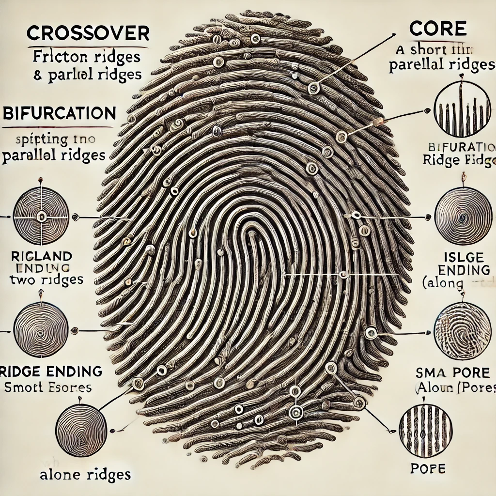
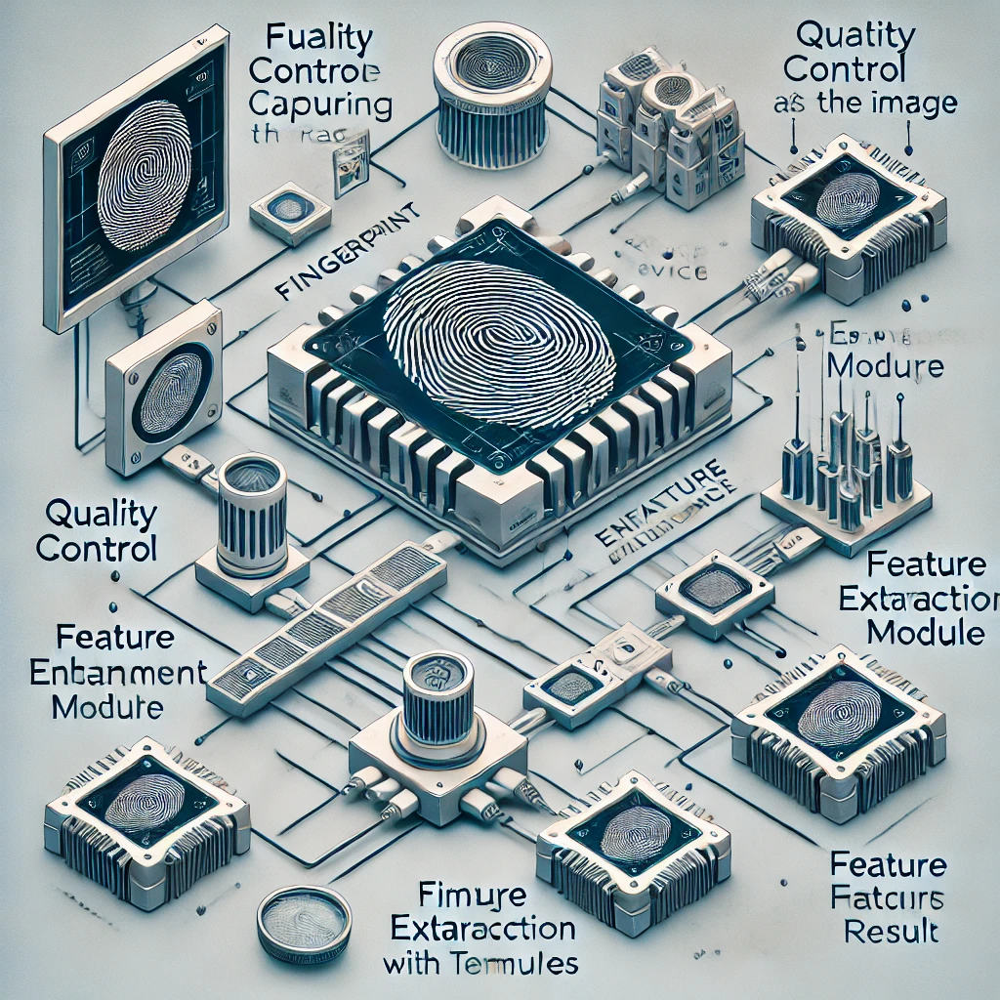
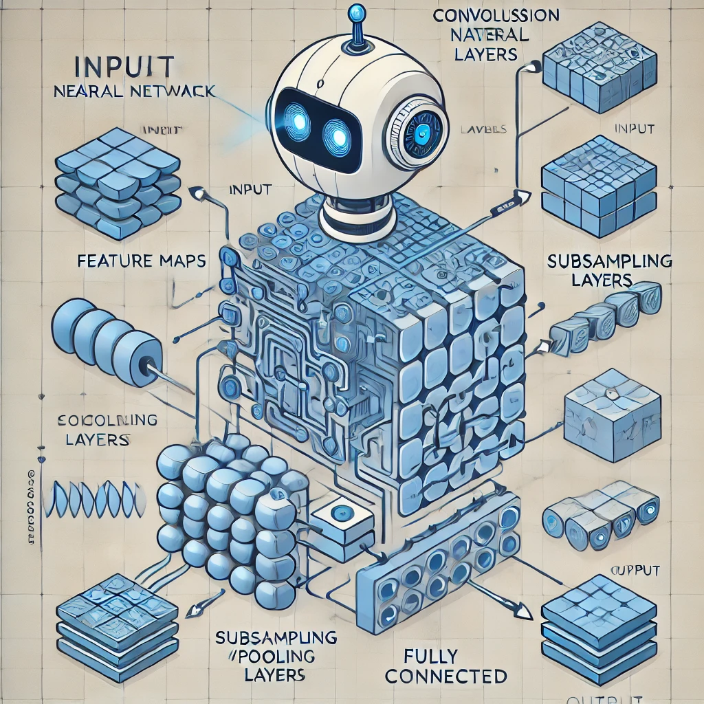
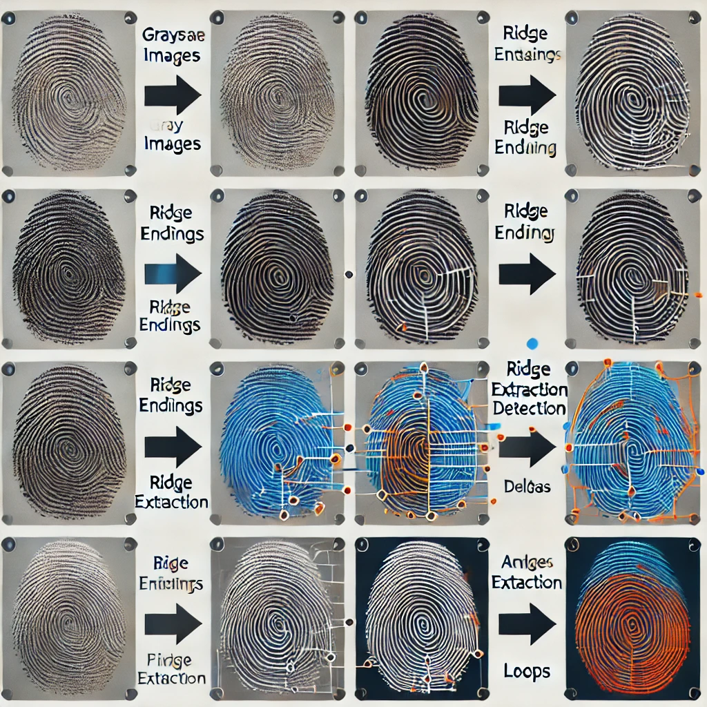

# Fingerprint-Detection-Using-Machine-Learning

# Abstract

This project involves the design of a Convolutional Neural Network (CNN) to detect whether fingerprints are fake or live. The project was completed in one month. Initially, a basic CNN model was developed for a small dataset of fingerprint images. Later, this model was adapted for a larger dataset containing thousands of fingerprint images. However, both attempts yielded low accuracy. To improve performance, predefined architectures such as VGG16 were employed. The original VGG16 architecture did not improve accuracy, so the softmax activation function in the last layer was replaced with a sigmoid activation function. This change led to slight improvements, but the accuracy remained below the acceptable threshold of 80%.

---

# 1. Introduction

## 1.1 Why Fingerprint?

Fingerprints are one of the most commonly used forms of biometric identification, surpassing other methods such as facial and voice recognition. They have been used as reliable identifiers for many years because fingerprint patterns remain consistent over time and are resistant to changes caused by aging or wear. Unlike facial or voice recognition, which can be temporarily altered due to external factors (e.g., illness), fingerprints offer a stable and reliable means of identification.

---

## 1.2 How is Fingerprint Identification Done?

Fingerprint identification involves several stages:
1. **Acquisition**: A live-scan device captures a digital image of the fingerprint, typically at 500 DPI, producing an 8-bit grayscale raw image. Advanced devices may also detect whether the fingerprint is live or fake to prevent spoofing attacks.
2. **Quality Control**: The raw image is assessed for quality. Low-quality samples are rejected, while acceptable ones proceed to the next stage.
3. **Image Enhancement**: This step improves the clarity of the ridge patterns in noisy regions to simplify feature extraction.
4. **Feature Extraction**: Features, such as minutiae points, ridge shapes, and local orientations, are extracted from the enhanced image. Depending on the matching algorithm, additional features may also be extracted.
5. **Fingerprint Matching**: The extracted features are compared against templates in a system database. In verification mode, a single template is matched to the sample. In identification mode, the sample is compared to all database templates to determine a match.

---

## 1.3 What is Machine Learning?

Machine learning involves the development of algorithms that enable computer systems to progressively improve their performance on specific tasks by learning from data. These algorithms use sample data, called "training data," to create mathematical models that can make predictions or decisions without explicit programming.

### Types of Machine Learning Algorithms:

1. **Supervised Learning**:
   - Relies on labeled data.
   - Consists of two main categories:
     - **Regression**: Predicts continuous values, e.g., salary or weight.
     - **Classification**: Predicts categorical outcomes, e.g., "cat" or "dog."

2. **Unsupervised Learning**:
   - Works with unlabeled data.
   - Groups data based on patterns and similarities.
   - Includes techniques like clustering and association.

---

## 1.4 What are Neural Networks?

Unlike traditional programming, where specific instructions are given to solve problems, neural networks learn from observational data to create solutions. Deep learning, a subset of neural networks, provides state-of-the-art solutions for tasks like image recognition, speech recognition, and natural language processing.

### Types of Neural Networks:
1. **Convolutional Neural Network (CNN)**: Best suited for image recognition tasks.
2. **Long Short-Term Memory (LSTM)**: Best suited for speech recognition tasks.

---

# 2. Proposed Model

## Objective

The goal is to design a neural network to classify fingerprints as live or fake using image inputs of size 300x300 pixels. The network will be trained on a dataset of fingerprint images collected from different sensors, categorized into two sets: fake and live.

This project implements a **supervised classification model** using a feedforward and backpropagation algorithm. The neural network is developed using the **Keras** library in Python.

---

## 2.1 Designing the Neural Network

### Dataset and Initial Model:
- A small dataset of 98 fingerprint samples in `.png` format was used initially.
- The CNN model was built using the Keras library on Google Colab.

Further experiments involved training the model on larger datasets and refining the architecture to improve performance.

### VGG16 Model

The VGG16 model, also known as the OxfordNet model, is a convolutional neural network (CNN) architecture developed by the Visual Geometry Group from Oxford University, which is why it is named VGG. This architecture was pivotal in helping the team secure a victory in the ILSVR (ImageNet Large Scale Visual Recognition) competition in 2014. 

Even today, VGG16 is regarded as one of the most effective vision models, thanks to its simplicity and depth. The architecture is characterized by its sequential arrangement of convolutional layers with small (3x3) filters and a consistent depth increase, followed by fully connected layers for classification tasks.

Despite its historical significance and continued use, more recent architectures like the Inception model and the ResNet model have surpassed VGG16 in terms of performance and efficiency on a variety of vision tasks.

### Results

The image below illustrates the pipeline results at each step with color-coded features:

- **Ending**: Highlighted in **Green**  
- **Bifurcation**: Highlighted in **Blue**  
- **Delta**: Highlighted in **Red**  
- **Loop**: Highlighted in **Orange**  
- **Whorl**: Highlighted in **Pink**

